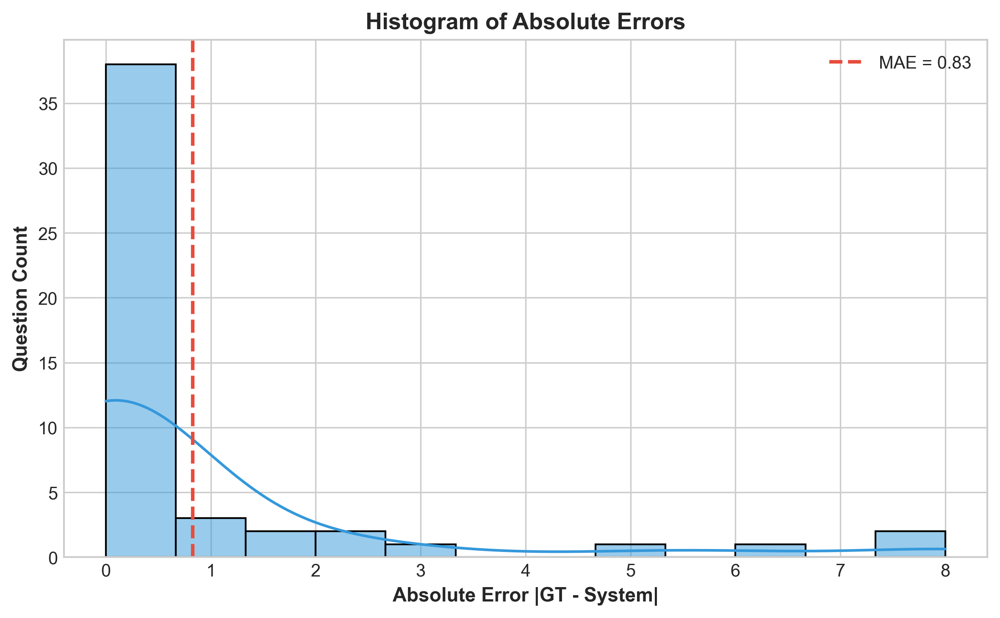
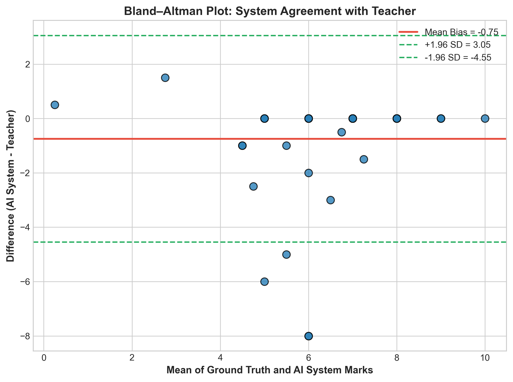
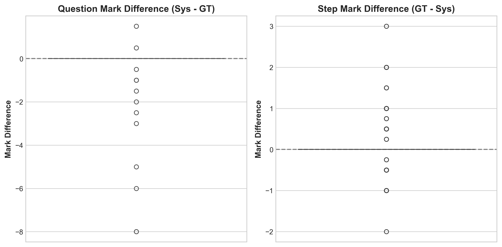
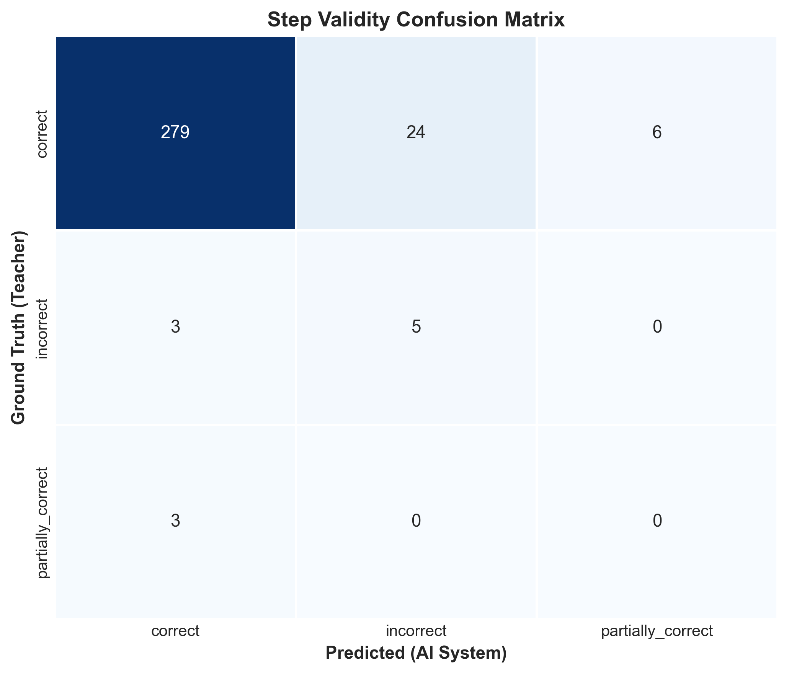
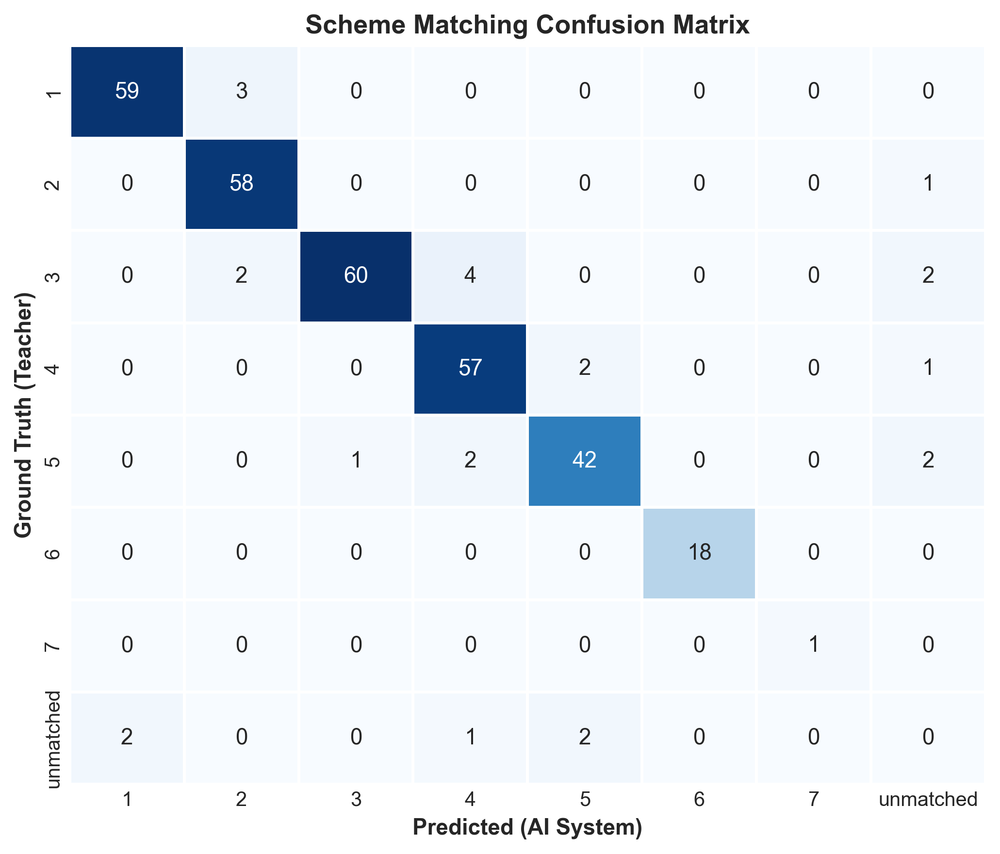
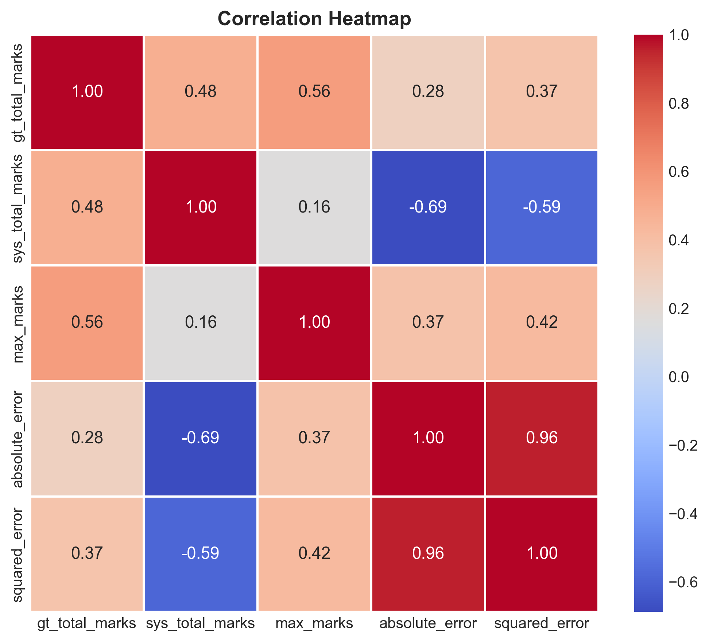

# Evaluation Report: AI-Based Stepwise Algebra Evaluation System

**Dataset**: Advanced Level Stepwise Mathematics Grading Benchmark  
**Total Questions ($N_Q$)**: 50 | **Total Solution Steps ($N_S$)**: 320

---

## 1. Question-Level Evaluation

| Metric | Measured Value | Interpretation |
| :--- | :---: | :--- |
| **MAE** | **0.8300** | Average magnitude of mark error per question. |
| **Pearson Correlation (r)** | **0.4810** | Linear alignment between Teacher and AI marks. |
| **Exact Match Accuracy** | **72.00%** | Percentage of exact score matches. |
| **Mean Bias Error (MBE)** | **-0.7500** | Directional bias (Positive = Lenient, Negative = Strict). |
| **RMSE** | **2.0797** | Root mean squared error (penalizes larger errors). |
| **R² Score** | **-0.3968** | Proportion of teacher score variance explained by AI. |

---

## 2. Step-Level Evaluation (Validity Classification)

| Metric | Measured Value | Interpretation |
| :--- | :---: | :--- |
| **Macro F1** | **0.4032** | Unweighted mean F1-score across all validity classes. |
| **Weighted F1** | **0.9139** | Class-weighted F1-score accounting for sample imbalance. |
| **Micro F1** | **0.8875** | Global F1-score across all individual predictions. |
| **F1 (correct)** | **0.9394** | F1-score for identifying fully valid mathematical steps. |
| **F1 (partially_correct)** | **0.0000** | F1-score for identifying partially correct steps. |
| **F1 (incorrect)** | **0.2703** | F1-score for identifying invalid/wrong steps. |
| **Cohen's κ** | **0.1821** | Inter-rater agreement controlling for chance. |
| **Accuracy** | **88.75%** | Overall step correctness classification rate. |
| **Precision** | **0.9496** | Weighted precision across validity classes. |
| **Recall** | **0.8875** | Weighted recall across validity classes. |

---

## 3. Step Marking Evaluation

| Metric | Measured Value | Interpretation |
| :--- | :---: | :--- |
| **Step MAE** | **0.3016** | Mean absolute error per step mark. |
| **Step RMSE** | **0.5752** | Root mean squared error per step mark. |
| **Pearson r** | **0.6082** | Correlation between step-level marks. |
| **Mean Difference** | **-0.1172** | Average difference (AI Marks - Teacher Marks). |

---

## 4. Visualizations

### 4.1 Question & Step Marking Visualizations
  
*Figure 1: Histogram of Question Absolute Errors.*

  
*Figure 2: Bland-Altman Plot of System Agreement.*

  
*Figure 3: Box Plot of Mark Differences (Question & Step Level).*

### 4.2 Confusion Matrices & Correlation
  
*Figure 4: Step Validity Confusion Matrix Heatmap.*

  
*Figure 5: Scheme Matching Confusion Matrix Heatmap.*

  
*Figure 6: Correlation Heatmap of Evaluation Metrics.*
